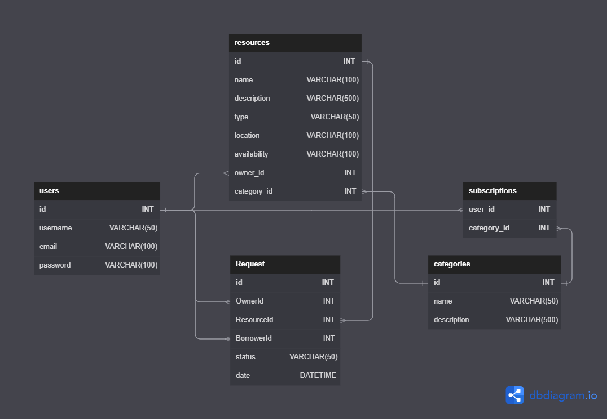

# ShareEase

This project aims to create a web-based platform that enables users to share and access resources such as books, equipment, and tools. The platform aims to promote community building and reduce waste by allowing people to lend or borrow items they may not need all the time.

# **Features**

- Advanced Search: Allows users to search for resources using advanced filters such as resource type, tags, location, availability, etc.
- Personalized Recommendations: recommend relevant resources based on their preferences and interests.
- Notification: The user can get a Notification when any relevant stuff is posted, approved, requested
- Gamification: Users can get their Badges according to their contribution
- Downloadable Invoice: User can Download their invoice statements in pdf/CSV format

# **Tech Stacks**

- **Frontend** - React Js, Chakra UI,React Router Dom
- **Backend** - [ASP.NET](http://ASP.NET) Core Web API,
- **Database** - SQL Server

# DB Design

